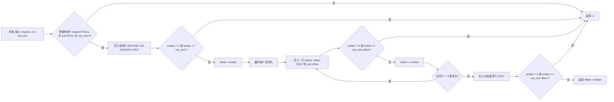

# build_encapsulated_request 流程图

该流程图描述 `echo_server.c` 中 `build_encapsulated_request` 的执行路径，用于将结构化 `Request` 重新封装为 HTTP 请求文本。

## 说明

1. 函数先做参数校验，任何空指针或非法缓冲区直接失败。
2. 请求行、请求头、结束空行均通过 `snprintf` 逐段写入。
3. `offset` 表示已写入长度，`out_size - offset` 表示剩余空间。
4. 任一步骤出现错误或截断，函数立即返回 `-1`。
5. 成功时返回总字节数，用于后续 `send()` 发送。
